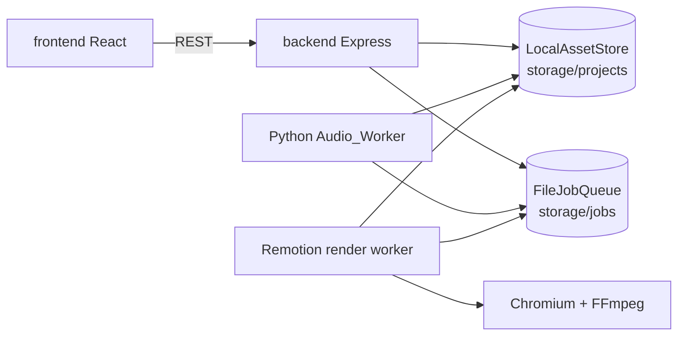
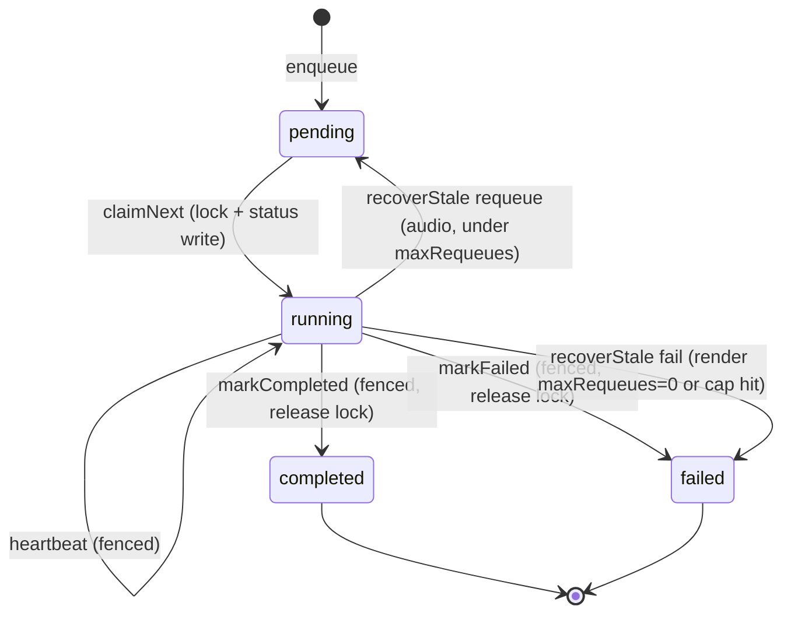
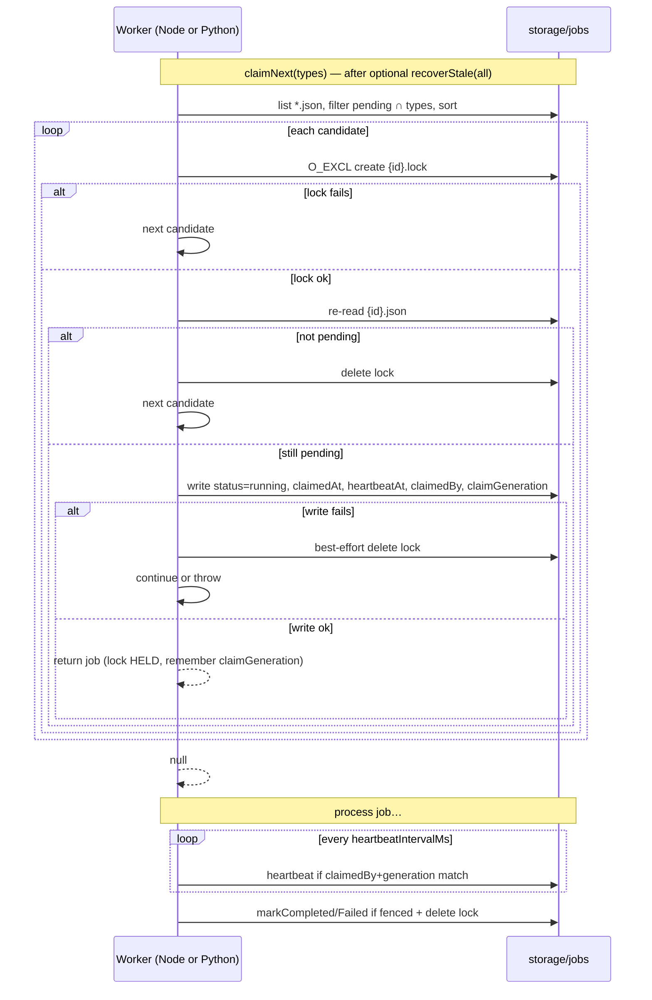
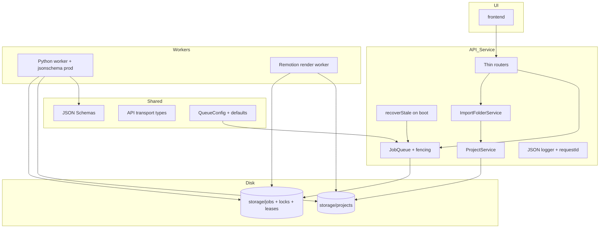
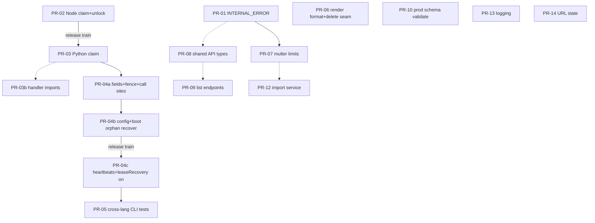

# Evolutionary Architecture Upgrade — Music Visualizer (Local-First)

| Field | Value |
| --- | --- |
| **Title** | Evolutionary Architecture Upgrade for Music Visualizer |
| **Author** | _TBD_ |
| **Date** | 2026-07-16 |
| **Status** | Approved (Revision 4 — design review consensus, 0 open issues) |
| **Repository** | https://github.com/trieu-0512/music-visualizer |
| **Workspace** | `F:\MMO\Nhac` |
| **Audience** | Senior engineers implementing incremental PRs on a single-machine Windows content-ops workflow |

---

## Overview

Music Visualizer is a **local-first monorepo** that turns a song folder (audio + visual assets) into lyric-synchronized, audio-reactive MP4s. The production path is:

**Import folder → Transcribe → Analyze → Build config → Render** (up to six 60fps MP4s).

The system is already usable: workspaces (`shared/`, `backend/`, `workers/`, `remotion/`, `frontend/`), path-traversal-safe `AssetStore`, shared JSON schemas, injectable seams, and property tests exist. This design does **not** propose a rewrite. It proposes an **evolutionary upgrade** that:

1. **Phase 0 — Correctness**: unify job-queue claim protocol (hybrid), leases/heartbeats/stale recovery (split PRs), fix error codes, honor render format params, bound upload memory, fail-loud handler imports.
2. **Phase 1 — Product / maintainability**: shared API transport types, list endpoints, **promote** existing Python `jsonschema` validation into production handlers, import service extraction, structured logging, URL state write-back.
3. **Phase 2 — Ops / scale (later)**: Redis/BullMQ optional backend, Docker Compose, auth, bundle cache, progress events, E2E, template enum in schema.

Target operator profile: single-machine content ops for kids’ music videos; Windows primary; no multi-tenant SaaS requirements in this upgrade’s v1 scope.

---

## Background & Motivation

### Current architecture (keep)

```text
music-visualizer/
  shared/     # schemas, TS types, validators, startup config
  backend/    # Express API + FileJobQueue + LocalAssetStore + ProjectService
  workers/    # Python Audio_Worker (transcribe, analyze)
  remotion/   # Remotion compositions + render worker (claim render jobs)
  frontend/   # React + Vite Web_App
  config/     # default.json → storage + queue backends
  storage/    # projects/{projectId}/… and jobs/{jobId}.json
```

| Concern | Implementation | Key paths |
| --- | --- | --- |
| Project address space | `(projectId, relativePath)` via `AssetStore` | `backend/src/storage/AssetStore.ts`, `workers/src/store.py` |
| Job queue | File JSON under `storage/jobs/` | `backend/src/queue/JobQueue.ts`, `workers/src/queue.py` |
| API | Express routers | `backend/src/app.ts`, `backend/src/routes/*` |
| Schemas | Ajv in shared; JSON schemas; Python tests already use `jsonschema` | `shared/src/schema/*`, `shared/src/validate.ts`, `workers/requirements.txt` (`jsonschema==4.25.1`) |
| Render | Remotion headless | `remotion/src/render.ts`, `remotion/src/renderWorker.ts` |



### Pain points (verified in code)

#### P0 — Correctness

**1. Dual `FileJobQueue` claim semantics diverge (cross-language hazard)**

| Step | Node `FileJobQueue.claimNext` (`backend/src/queue/JobQueue.ts`) | Python `JobQueue.claim_next` (`workers/src/queue.py`) |
| --- | --- | --- |
| Select candidates | `status === "pending"` + type filter, oldest-first | same |
| Lock | `open(..., "wx")` O_EXCL → `{jobId}.lock` | `os.open(..., O_CREAT\|O_EXCL\|O_WRONLY)` |
| Disk status on claim | **Immediately writes `running`** | **Leaves `pending`**; `worker.process_job` calls `mark_running` later |
| Lock lifetime | **Released in `finally` before return** | **Held until `mark_completed` / `mark_failed`** |
| Re-read under lock | Yes — abort if no longer pending | No re-read under lock |

Node path (simplified):

```101:127:backend/src/queue/JobQueue.ts
  async claimNext(types: JobType[]): Promise<Job | null> {
    // ...
    for (const candidate of candidates) {
      if (!(await this.tryLock(candidate.id))) {
        continue;
      }
      try {
        const fresh = await this.get(candidate.id);
        if (fresh === null || fresh.status !== "pending") continue;
        const claimed: Job = {
          ...fresh,
          status: "running",
          updatedAt: new Date().toISOString(),
        };
        await this.writeJob(claimed);
        return claimed;
      } finally {
        await rm(this.lockPath(candidate.id), { force: true });
      }
    }
    return null;
  }
```

Python path (simplified):

```165:192:workers/src/queue.py
    def claim_next(self, types: list[str] | tuple[str, ...]) -> Job | None:
        # ...
        for job in candidates:
            try:
                fd = os.open(
                    self._lock_path(job.id), os.O_CREAT | os.O_EXCL | os.O_WRONLY
                )
            except FileExistsError:
                continue
            os.close(fd)
            return job  # still pending on disk
        return None
```

**Important:** Node’s **current** code already sets `running` under lock but **releases the lock in `finally` before return**. Python holds the lock for the whole run but delays the status write. The target protocol is a **hybrid** of both (see KD-1)—not “copy Node as-is.”

Also verified: Node `markCompleted` / `markFailed` only update JSON status—they **never** delete `{id}.lock` (`JobQueue.ts` 133–138). That is harmless today because `claimNext` always releases in `finally`. After the hybrid protocol holds locks for the run, **terminal methods must release locks** in the same PR that changes claim (PR-02), or every completed Node job permanently poisons the queue.

**Failure modes today:**

| Scenario | Severity | Effect |
| --- | --- | --- |
| Python crash after lock, before `mark_running` | **High** | Forever stuck: `pending` + orphan `.lock` → never re-claimable |
| Python crash after `mark_running` | **High** | Forever stuck: `running` + lock until process death leaves lock |
| Node crash after claim | **High** | Forever stuck: `running`, no lock, no recovery |
| Cross-worker semantic mismatch | **Medium** | Operators/debugging assume “lock means in-flight”; Node releases lock while running |
| Double `mark_running` / status races under mixed tooling | **Medium** | Hard to reason about; tests encode two different contracts |

**2. No stale-job recovery / heartbeats**

Neither queue implementation tracks `claimedAt`, `heartbeatAt`, or worker identity. There is no sweeper. A single process kill leaves jobs terminal-stuck until manual JSON surgery under `storage/jobs/`.

**3. Unexpected 500 mapped to `VALIDATION_ERROR`**

```116:124:backend/src/http/errors.ts
export const errorHandler: ErrorRequestHandler = (err, _req, res, _next) => {
  if (err instanceof ApiError) {
    res.status(err.status).json(err.toEnvelope());
    return;
  }
  res.status(500).json({
    error: { code: "VALIDATION_ERROR", message: "Internal server error" },
  });
};
```

Clients and tests that branch on `code` will mis-classify infrastructure bugs as client validation failures. There is **no** `INTERNAL_ERROR` (or equivalent) in `ApiErrorCode` today.

**4. Render format UI ignored by render worker**

- UI sends `params: { format: renderFormat }` from `frontend/src/pages/JobsPage.tsx` (`triggerJob` for `type === "render"`).
- API stores params on the job (`backend/src/routes/jobs.ts` `parseParams`).
- `remotion/src/renderWorker.ts` documents params as unused; `processRenderJob` loads config and calls `renderProject(config, store)`.
- `renderProject` expands targets from **`config.videoFormat` only** (`remotion/src/render.ts` `expandRenderTargets(config.videoFormat)`).

Selecting Landscape-only in the UI still renders whatever `project-config.json` contains (often `"both"` → six outputs).

**5. Multer `memoryStorage` without size limits**

```33:36:backend/src/routes/projects.ts
  const upload = multer({
    storage: multer.memoryStorage(),
    preservePath: true,
  });
```

Same pattern in `backend/src/routes/assets.ts` (single-file upload). `import-folder` uses `upload.array("files")` and can load an entire song tree into RAM unbounded — OOM risk on large WAV / mistaken multi-folder drops.

**6. Silent handler import swallows dependency failures (P0.5 / Phase 0)**

`workers/src/worker.py` `_load_default_handlers` uses bare `except Exception: pass`. A failed WhisperX/librosa install surfaces later as cryptic `no handler registered for job type: …` on the job. This is **operator-facing correctness**, not polish—promoted into Phase 0 (PR-03b).

#### P1 — Maintainability / product

| # | Issue | Evidence |
| --- | --- | --- |
| 7 | API transport types duplicated | `frontend/src/api/types.ts` mirrors `ProjectRecord`, `Job`, `ApiErrorCode`, etc. from backend — only artifact schemas live in `shared` |
| 8 | Missing list endpoints | No `GET /projects`; no `GET /projects/:id/jobs` despite `listByProject` on both queues |
| 9 | Python **production** handlers do not validate outputs before `mark_completed` | `jsonschema==4.25.1` is **already** in `workers/requirements.txt` and used in property/integration **tests** (`Draft202012Validator` against `shared/src/schema/*`). Gap is production path only—not a greenfield dependency |
| 10 | Import god-route | ~445 lines in `backend/src/routes/projects.ts` (inspect, normalize, parse metadata, write assets, optional config build) |
| 11 | No structured logging / correlation IDs | `console.log` in render worker entry; Express has no request id middleware |
| 12 | URL state not written back | `App.tsx` `readUrlState()` on boot; `setActivePageId` / `setProjectId` never update `window.location` |

#### P2 — Explicitly later

Redis/BullMQ, Docker Compose, auth, Remotion bundle cache, progress SSE/WebSocket, full E2E, template enum tightening in `project-config.schema.json`.

### Why evolutionary (not rewrite)

- Local-first file storage and Remotion are product-fit for single-machine ops.
- Shared schemas, property tests, and structural seams (`RenderJobQueue`, injectable stores) already support incremental change.
- Queue interface already documents a future BullMQ path (`createJobQueue` switch on `config.backend`).
- Rewrite cost would dominate residual correctness bugs that are fixable in small PRs.

---

## Goals & Non-Goals

### Goals

1. **One hybrid claim protocol** for Node and Python file queues, documented and test-enforced (including cross-language integration on Windows).
2. **Automatic recovery** of stale `running` jobs and orphan locks on a configurable lease TTL, with fencing so late heartbeats/completions cannot clobber a new claim.
3. **Honest API errors**: unexpected failures use `INTERNAL_ERROR` + 500; validation and multer limits stay `VALIDATION_ERROR`.
4. **Render params honored**: job `params.format` (when valid) overrides `config.videoFormat` for that job only, with full type/wiring updates and pre-render final-MP4 cleanup.
5. **Bounded upload memory** for import-folder and asset upload, with `MulterError` → `VALIDATION_ERROR` mapping in `errorHandler`.
6. **Shared transport types** in `@music-visualizer/shared` consumed by frontend and backend.
7. **List projects / list project jobs** for operator UX.
8. **Schema-validate** lyrics / audio-analysis outputs in Python handlers before `mark_completed` (reuse existing `jsonschema` pin and schema paths).
9. **Observable** request + job correlation for local debugging.
10. **Incremental PR plan** where each PR is reviewable and mergeable alone (claim recovery split across PR-04a/b/c).

### Non-Goals (upgrade v1)

- Multi-user auth, multi-tenant isolation, cloud object storage.
- Replacing Remotion or Express.
- Moving off local file storage as the default.
- Implementing BullMQ/Redis in Phase 0/1 (interfaces may prepare for it).
- Changing the song-folder contract (required roles A–Z, audio, logos, etc.).
- Full CI E2E with WhisperX GPU in Phase 0 (unit/property/cross-lang claim tests only).
- Rewriting frontend to a router library (minimal URL sync is enough).

---

## Key Decisions

| ID | Decision | Rationale |
| --- | --- | --- |
| **KD-1** | **Hybrid claim protocol** (not “Node’s intent”): under O_EXCL lock, re-read, transition `pending → running` with claim metadata, **return with lock held** until terminal transition. Combines Node’s status transition with Python’s lock lifetime. | Copying only half of either implementation is wrong. Hybrid matches operator mental model: lock means in-flight; status on disk means in-flight. |
| **KD-2** | **Lock semantics**: `{jobId}.lock` means “a worker currently owns this job.” Terminal transitions (`completed` / `failed`) **and** recover **always** release the lock. Claim never returns while leaving status `pending`. Node `markCompleted`/`markFailed` must gain lock release (they lack it today). | Prevents permanent lock poison after protocol change. |
| **KD-3** | **Lease + heartbeat fields** (additive JSON): `claimedAt`, `heartbeatAt`, `claimedBy`, `claimGeneration` (monotonic int, default 0), `requeueCount`. Defaults: **`leaseMs: 120_000`**, **`heartbeatIntervalMs: 15_000`**. Stale if `now - heartbeatAt > leaseMs` (fallback to `claimedAt` if heartbeat missing). | 120s lease fits WhisperX cold start on modest Windows boxes while failing fast enough for ops; 15s heartbeat (~8 beats per lease) tolerates GC/AV stalls without false recovery. |
| **KD-4** | **Requeue formula (single, unambiguous)**: On stale recovery for a job: `if ((job.requeueCount ?? 0) >= maxRequeuesFor(job.type)) { markFailed("stale lease expired"); } else { requeueCount++; status=pending; clear claim fields; claimGeneration++; release lock }`. Defaults: **`maxRequeues.audio` (transcribe/analyze) = 1** ⇒ total 2 attempts; **`maxRequeues.render` = 0** ⇒ **fail stale, never auto-requeue render**. Config may override both. | “Requeue once” ≡ `maxRequeues: 1`. Render auto-requeue risks mixed partial MP4s and expensive restarts; fail-and-operator-retry is safer until atomic publish exists. |
| **KD-5** | **`INTERNAL_ERROR` code** for unexpected 500s; keep `VALIDATION_ERROR` for 400 only. Map `MulterError` codes to `VALIDATION_ERROR` in `errorHandler`. | Fixes client misclassification; multer limits must not become 500s once introduced. |
| **KD-6** | **Render format precedence**: `params.format` if in `{landscape,portrait,both}` else `config.videoFormat`. **Does not rewrite** `project-config.json`. Precedence for targets: **effectiveFormat → `expandRenderTargets` → optional `targetSelectors` filter**. On **render job process start** (after claim, before encode): **best-effort delete** all standardized `artifacts/final-*.mp4` paths for the project (the six catalog names) to avoid mixed outputs from prior runs / partial crashes. Log `effectiveFormat` + expanded target list. | Matches UI; cleanup is cheap for local ops and unblocks safe retry without auto-requeue. |
| **KD-7** | **Upload limits**: shared multer factory with `limits.fileSize` (default 200 MiB) and `limits.files` (default 80 for import). Phase 0 = memoryStorage + hard limits + `errorHandler` Multer mapping. Phase 2 optional disk staging. | Stops OOM without full streaming redesign. |
| **KD-8** | **Transport types move to `shared`**, backend/frontend re-export. Artifact schemas stay as-is. | Single source of truth for API DTOs. |
| **KD-9** | **Evolutionary only**: keep monorepo, file storage default, Remotion, Python workers, Express. | Matches product constraints. |
| **KD-10** | **Python schema validation** reuses **existing** `jsonschema==4.25.1` and `shared/src/schema/*.json` paths already used in tests (`Draft202012Validator`). Promote into `workers/src/validate_artifacts.py` called from handlers—not a new dependency. | Req 15.4 SSOT; real drift risk is Ajv vs Draft 2020-12 dialect, already exercised in tests. |
| **KD-11** | **Handler import failures**: always log at error level; register failing stub that `mark_failed`s with import message. Optional `MV_STRICT_HANDLERS=1` fail-fast on worker boot. Phase 0 PR. | Silent empty `DISPATCH` is operator-facing correctness. |
| **KD-12** | **Phase boundaries**: P0 correctness before product polish; no Redis until Phase 2. Claim recovery split **PR-04a / 04b / 04c**. **PR-04b + PR-04c are a release train** (same operator rule as PR-02/03): do not run production API/workers against lease-based running recovery until heartbeats land. | Prevents healthy long jobs (>120s) from being fail/requeued while no process heartbeats. |
| **KD-13** | **Claim write failure cleanup**: `try { lock; re-read; write running+claim fields } catch { best-effort release lock; continue or rethrow }`. Never return a claim without a successful status write. | Prevents orphan locks without matching `running`. |
| **KD-14** | **Ownership fencing (strict)**: `heartbeat`, `markCompleted`, `markFailed` succeed **only if** `status === "running"` **and** `claimedBy === workerId` **and** `claimGeneration === generation` (from claim time). **No** “OR holds lock file” branch—lock files are empty presence markers after fd close, not OS ownership tokens. On mismatch: throw `OwnershipError` / no-op **without** mutating the job. Late `markCompleted` after recover+reclaim must not clobber. | Generation + claimedBy alone fence dual workers; lock existence is not a capability. |
| **KD-15** | **`recoverStale` scope**: always scans **all** jobs/orphan locks **regardless of caller job types**. Invoked on: (1) API process boot, (2) each worker boot, (3) opportunistic start of `claimNext`, (4) optional worker-loop tick. Does **not** take a type filter. **Modes** (see KD-20): orphan-only vs full lease recovery. | Stuck jobs heal; mode prevents pre-heartbeat slaughter. |
| **KD-16** | **Queue factories + constructors normalize defaults**: loaders **and** `FileJobQueue` / Python `JobQueue` constructors apply `leaseMs ?? 120_000`, `heartbeatIntervalMs ?? 15_000`, `maxRequeuesAudio ?? 1`, `maxRequeuesRender ?? 0`, `leaseRecoveryEnabled ?? false` even when tests pass bare `{ backend: "file", dir }` or a bare dir string. | Prevents `undefined` lease comparisons / NaN in unit tests and ad-hoc factories. |
| **KD-17** | **Python `Job` serde must round-trip additive fields** in the same PR that introduces them (or earlier PR-03 if claim metadata begins). `mark_running` is a **no-op without rewrite** when already `running` (or removed from `process_job` in the claim-unification PR). | Prevents silent field stripping on every RMW. |
| **KD-18** | **Job ids are opaque strings**. Node uses hyphenated UUID; Python uses 32-hex `uuid4().hex`. Tests must not assume one shape. | Avoid brittle golden fixtures. |
| **KD-19** | **PR-02 + PR-03 are a release train**: operators must not run mixed Node/Python queue protocols against production `storage/jobs`. Document stop-workers-until-both-land. PR-06 (render format) ships in parallel as soon as ready—no dependency on leases. | Limits mixed-protocol window; delivers UI fix early. |
| **KD-20** | **Staged recover mutations**: Until heartbeats are live, `recoverStale` runs in **`orphanOnly` mode**: may **break** orphan locks via `mayBreakLock` then clean them (`pending`+stale lock → leave pending claimable; terminal/missing + lock → delete lock). **Never** fail/requeue/steal locks for `status===running` in orphanOnly (including lease-expired heartbeats). **Full** mode (`leaseRecoveryEnabled === true`, default true only after **PR-04c**): also mayBreakLock on `running`+lease expired → KD-4. PR-04a/04b leave flag **false**. | Orphan path must work before heartbeats; running jobs stay safe until 04c. |
| **KD-21** | **Concurrent `recoverStale`**: for each jobId, if lock exists and `mayBreakLock(mode,…)` then **forceUnlink** first; then `tryLock`; re-read; re-check; single mutate; release. If `tryLock` fails after optional break → skip (peer recoverer won). Lock files are empty presence markers—**break is the only way** into the critical section when a lock already exists. | Aligns algorithm with orphan cleanup; prevents double requeue under full mode. |
| **KD-22** | **Fenced terminal call sites land in PR-04a (option A)**: same PR that makes `OwnershipOpts` required on `markCompleted`/`markFailed`/`heartbeat` updates **all production callers** (`workers/src/worker.py` `process_job`, `remotion/src/renderWorker.ts` `processRenderJob`/`runRenderWorker`, queue tests). Callers pass `workerId` + `claimGeneration` from the claimed job. Heartbeat **loops** wait for PR-04c; completion is already fenced. No optional unfenced overload in production. | Avoids signature limbo where 04a breaks compile or silently disables fencing. |
| **KD-23** | **`RenderAssetStore.delete`**: extend structural seam with `delete(ref): Promise<void>` (required for cleanup path). `clearStandardFinalMp4s` uses `delete` best-effort (ignore missing). `LocalAssetStore` already has `delete`. PR-06 owns interface + fakes + tests. | Cleanup without `fs.unlink` or casting through backend types. |

---

## Proposed Design

### 1. Unified hybrid job claim protocol

#### Target state machine



#### Claim sequence (both languages) — with failure cleanup



**Claim algorithm (pseudocode, both langs):**

```text
function claimNext(types, workerId):
  recoverStale()  // global; orphanOnly unless leaseRecoveryEnabled (KD-20)
  for candidate in pendingMatching(types) oldestFirst:
    if not tryLock(candidate.id): continue
    try:
      fresh = read(candidate.id)
      if fresh is null or fresh.status != "pending":
        releaseLock(candidate.id); continue
      gen = (fresh.claimGeneration ?? 0)  // keep existing gen; bump only on requeue
      next = {
        ...fresh,
        status: "running",
        claimedAt: now, heartbeatAt: now,
        claimedBy: workerId,
        claimGeneration: gen,
        updatedAt: now
      }
      writeJob(next)   // must succeed
      return next      // lock still held
    catch err:
      releaseLock(candidate.id)  // best-effort
      // log; continue to next candidate (or rethrow if catastrophic)
  return null
```

#### Fencing rules for mutating methods (KD-14 — strict)

| Method | Preconditions (all required) | On failure |
| --- | --- | --- |
| `heartbeat(jobId, opts)` | `status==running` && `claimedBy==opts.workerId` && `claimGeneration==opts.claimGeneration` | Throw `OwnershipError` or return unchanged; **do not** update heartbeat |
| `markCompleted` / `markFailed` | **same three predicates** | No mutation of another claim’s job; do **not** use “lock file exists” as a substitute for `claimedBy` |
| Terminal success side effect | After fenced write of completed/failed | Delete `{id}.lock` |

Lock release is a **side effect** of terminal/recover success, **not** a fencing token. Implementers must not code `if (lockExists) allow`.

**Race test (required):** claim as worker A → (with `leaseRecoveryEnabled`) freeze clock past lease → `recoverStale` requeues or fails → (if requeued) worker B claims with new generation → worker A late `heartbeat`/`markCompleted` must **not** mutate B’s job (assert generation mismatch).

**Idempotency:** terminal methods applied twice: second call sees non-running / generation mismatch and no-ops or throws without corrupting artifacts list.

#### `recoverStale` algorithm (KD-15, KD-20, KD-21) — implement exactly

Locks are empty files after create+close. **Every useful orphan already has a lock**, so O_EXCL `tryLock` alone always fails. Recoverers must **`mayBreakLock` → forceUnlink → tryLock** before cleaning.

```text
// lockAge(jobId) = now - mtime({jobId}.lock); treat missing lock as age = +inf

function mayBreakLock(mode, job /* Job|null */, jobId, now) -> bool:
  // job == null means .lock exists without .json
  if job == null:
    return true  // lock-without-record: always breakable in both modes

  if job.status in {completed, failed}:
    return lockExists(jobId)  // leftover lock on terminal: always breakable

  if job.status == pending:
    // Legacy Python claim / mid-claim crash: pending must not hold a lock.
    // Require age so we do not race a live claimNext still writing running.
    return lockExists(jobId) and lockAge(jobId) > config.leaseMs
    // (leaseMs default 120s >> claim write latency; optional tighter claimGraceMs OK)

  if job.status == running:
    if mode == "orphanOnly":
      return false  // NEVER break locks on running before heartbeats (KD-20)
    // mode == "full":
    return leaseExpired(job, now)
    // leaseExpired: now - (heartbeatAt ?? claimedAt ?? updatedAt) > leaseMs
    // missing claim timestamps after deploy: treat as expired ONLY in full mode

  return false


function recoverStale(now = Date.now()):
  mode = config.leaseRecoveryEnabled ? "full" : "orphanOnly"
  affected = []

  // Candidates = all job ids from *.json ∪ stems of *.lock
  for jobId in allJobIdsAndLockStems():
    job = readJob(jobId)  // null if only lock

    // --- enter critical section (possibly by breaking an orphan/stale lock) ---
    if lockExists(jobId) and mayBreakLock(mode, job, jobId, now):
      forceUnlinkLock(jobId)

    if not tryLock(jobId):
      // Peer recoverer won, or live claim holds lock we must not break
      continue

    try:
      fresh = re-read(jobId)  // re-check under our lock

      // --- orphanOnly: clean locks only; never change running status ---
      if mode == "orphanOnly":
        if fresh is null:
          releaseLock(jobId)  // we held lock for missing job
          affected.push(jobId); continue
        if fresh.status in {completed, failed}:
          releaseLock(jobId)  // drop leftover
          affected.push(jobId); continue
        if fresh.status == pending:
          // We only reach here if we broke a stale lock or no lock existed
          releaseLock(jobId)  // leave pending unlocked + claimable
          affected.push(jobId); continue
        // fresh.status == running: must not have broken; release if we
        // somehow hold lock without a live owner (should not break above)
        releaseLock(jobId)  // do NOT apply KD-4; leave running record as-is
        continue

      // --- full mode: orphan cleanup + lease KD-4 on running ---
      if fresh is null:
        releaseLock(jobId); affected.push(jobId); continue
      if fresh.status in {completed, failed}:
        releaseLock(jobId); affected.push(jobId); continue
      if fresh.status == pending:
        releaseLock(jobId); affected.push(jobId); continue  // orphan unlock

      // running
      if not leaseExpired(fresh, now):
        // Live job: we should not have broken its lock; if we hold lock
        // incorrectly, release and leave (prefer not to steal live work)
        releaseLock(jobId)
        continue

      // Re-check still running + expired under lock, then KD-4 once
      if (fresh.requeueCount ?? 0) >= maxRequeuesFor(fresh.type):
        write status=failed, error="stale lease expired", clear claim fields
        releaseLock(jobId)
      else:
        write status=pending, requeueCount+1, clear claim fields,
              claimGeneration+1
        releaseLock(jobId)  // pending must be unlocked
      affected.push(jobId)
    catch:
      best-effort releaseLock if we still own it this pass
  return affected
```

**`mayBreakLock` summary**

| On-disk situation | orphanOnly | full |
| --- | --- | --- |
| `.lock` without `.json` | break | break |
| `completed`/`failed` + lock | break | break |
| `pending` + lock, age > `leaseMs` | break | break |
| `pending` + lock, age ≤ `leaseMs` | **no** (avoid racing claimNext) | **no** |
| `running` + lock, lease OK | **no** | **no** |
| `running` + lock, lease expired | **no** | **break** then KD-4 |
| `running`, no lock, lease expired | n/a (no lock) | tryLock succeeds → KD-4 |
| `running`, any, orphanOnly | **leave entirely** | — |

**Required unit tests**

1. `pending` + lock older than lease + `leaseRecoveryEnabled=false` → lock **gone**, status still `pending`, claimable.
2. `completed` + leftover lock + flag false → lock gone; status still completed.
3. `running` + lock + old/missing heartbeat + flag false → **unchanged** (status, lock, fields).
4. `running` + expired lease + flag true → single KD-4 apply; concurrent double `recoverStale` → `requeueCount` +1 once.
5. Lock without json → lock removed under both modes.

**Staging vs full (KD-20):**

| Deploy stage | `leaseRecoveryEnabled` | What recover does |
| --- | --- | --- |
| After PR-04a/04b only | **`false` (default)** | Orphan lock **break+clean** only; **never** fail/requeue `running` |
| After PR-04c (or 04b+04c train) | **`true`** | Orphan cleanup **plus** full KD-4 on expired `running` |

Operators who pull `main` after 04b without 04c are safe: long WhisperX/Remotion jobs are not killed. Legacy `pending`+lock and leftover terminal locks **are** healed.

#### Interface changes (`Job` record)

Additive fields (optional on historical completed/failed jobs):

```ts
// lands in shared transport types + both queue implementations
interface Job {
  id: string; // opaque — do not assume UUID shape (KD-18)
  projectId: string;
  type: JobType;
  status: JobStatus;
  params: Record<string, unknown>;
  artifacts: string[];
  error?: string;
  createdAt: string;
  updatedAt: string;
  // NEW
  claimedAt?: string;
  heartbeatAt?: string;
  claimedBy?: string; // e.g. "audio-worker:hostname:pid:1234"
  claimGeneration?: number; // fencing token; increment on each requeue
  requeueCount?: number;
}
```

#### API surface on `JobQueue`

```ts
interface ClaimOptions {
  workerId: string;
}

interface OwnershipOpts {
  workerId: string;
  claimGeneration: number;
}

interface JobQueue {
  enqueue(job: Pick<Job, "projectId" | "type" | "params">): Promise<Job>;
  get(jobId: string): Promise<Job | null>;
  listByProject(projectId: string): Promise<Job[]>;

  /** Atomically lock + pending→running; holds lock until terminal/recover. */
  claimNext(types: JobType[], opts: ClaimOptions): Promise<Job | null>;

  /** OwnershipOpts required — no unfenced production overload (KD-22). */
  heartbeat(jobId: string, opts: OwnershipOpts): Promise<Job>;
  markCompleted(jobId: string, artifacts: string[], opts: OwnershipOpts): Promise<Job>;
  markFailed(jobId: string, error: string, opts: OwnershipOpts): Promise<Job>;

  /**
   * Scan ALL jobs/orphan locks (no type filter). Behavior depends on
   * config.leaseRecoveryEnabled (KD-20): orphanOnly vs full lease recovery.
   * Concurrent-safe via per-job tryLock (KD-21).
   */
  recoverStale(opts?: { now?: Date }): Promise<Job[]>;

  /**
   * @deprecated Prefer claimNext setting running.
   * If retained: pure no-op when already running (must NOT rewrite record / strip fields).
   */
  markRunning?(jobId: string): Promise<Job>;
}
```

**Worker loops** pass `workerId` (stable per process) and the `claimGeneration` from the claimed job into heartbeat/terminal calls.

**PR ownership for signatures (KD-22 — option A):**

| Change | PR |
| --- | --- |
| Queue methods require `OwnershipOpts`; implement fencing | **PR-04a** |
| Update `workers/src/worker.py` `process_job` to pass opts from claimed job | **PR-04a** (same PR — no limbo) |
| Update `remotion/src/renderWorker.ts` `processRenderJob` / claim loop to pass opts | **PR-04a** |
| Update all queue unit/property tests | **PR-04a** |
| Heartbeat **interval loops** only | **PR-04c** |

After PR-04a, a claimed job can `markCompleted`/`markFailed` safely with fencing even before heartbeats exist. Lease-based recover of `running` stays off until PR-04c (KD-20).

#### Config plumbing (KD-16) — loaders **and** constructors normalize defaults

**Today (problem):**

- Node: `createJobQueue(config) → new FileJobQueue(config.dir)` — only `dir`.
- Python: `create_job_queue(config) → JobQueue(config.dir)` — only `dir`.
- `assertQueueConfig` / `parse_config` only accept `backend` + `dir` and **drop** unknown keys.
- Tests often call `new FileJobQueue(dir)` or `createJobQueue({ backend: "file", dir })` without lease fields.

**Target shapes:**

```ts
// shared/src/config/types.ts
export interface QueueConfig {
  backend: QueueBackend;
  dir: string;
  leaseMs?: number;                 // default 120_000
  heartbeatIntervalMs?: number;     // default 15_000
  maxRequeuesAudio?: number;        // default 1
  maxRequeuesRender?: number;       // default 0
  /** Full lease recovery on running jobs; default false until PR-04c (KD-20). */
  leaseRecoveryEnabled?: boolean;
}

export const QUEUE_CONFIG_DEFAULTS = {
  leaseMs: 120_000,
  heartbeatIntervalMs: 15_000,
  maxRequeuesAudio: 1,
  maxRequeuesRender: 0,
  leaseRecoveryEnabled: false,
} as const;

// shared/src/config/loader.ts — assertQueueConfig defaults missing keys
function assertQueueConfig(value: unknown): QueueConfig {
  // ... existing backend/dir checks ...
  return {
    backend: queue.backend as QueueConfig["backend"],
    dir: queue.dir as string,
    leaseMs: optionalPositiveInt(queue.leaseMs, QUEUE_CONFIG_DEFAULTS.leaseMs),
    heartbeatIntervalMs: optionalPositiveInt(
      queue.heartbeatIntervalMs,
      QUEUE_CONFIG_DEFAULTS.heartbeatIntervalMs,
    ),
    maxRequeuesAudio: optionalNonNegInt(queue.maxRequeuesAudio, 1),
    maxRequeuesRender: optionalNonNegInt(queue.maxRequeuesRender, 0),
    leaseRecoveryEnabled:
      typeof queue.leaseRecoveryEnabled === "boolean"
        ? queue.leaseRecoveryEnabled
        : QUEUE_CONFIG_DEFAULTS.leaseRecoveryEnabled,
  };
}

// backend — constructors re-normalize so bare test configs work
export class FileJobQueue implements JobQueue {
  private readonly leaseMs: number;
  private readonly leaseRecoveryEnabled: boolean;
  // ...
  constructor(config: QueueConfig | string) {
    if (typeof config === "string") {
      this.dir = resolveDir(config);
      this.leaseMs = QUEUE_CONFIG_DEFAULTS.leaseMs;
      this.heartbeatIntervalMs = QUEUE_CONFIG_DEFAULTS.heartbeatIntervalMs;
      this.maxRequeuesAudio = QUEUE_CONFIG_DEFAULTS.maxRequeuesAudio;
      this.maxRequeuesRender = QUEUE_CONFIG_DEFAULTS.maxRequeuesRender;
      this.leaseRecoveryEnabled = QUEUE_CONFIG_DEFAULTS.leaseRecoveryEnabled;
      return;
    }
    this.dir = resolveDir(config.dir);
    this.leaseMs = config.leaseMs ?? QUEUE_CONFIG_DEFAULTS.leaseMs;
    this.heartbeatIntervalMs =
      config.heartbeatIntervalMs ?? QUEUE_CONFIG_DEFAULTS.heartbeatIntervalMs;
    this.maxRequeuesAudio =
      config.maxRequeuesAudio ?? QUEUE_CONFIG_DEFAULTS.maxRequeuesAudio;
    this.maxRequeuesRender =
      config.maxRequeuesRender ?? QUEUE_CONFIG_DEFAULTS.maxRequeuesRender;
    this.leaseRecoveryEnabled =
      config.leaseRecoveryEnabled ?? QUEUE_CONFIG_DEFAULTS.leaseRecoveryEnabled;
  }
}

export function createJobQueue(config: QueueConfig): JobQueue {
  switch (config.backend) {
    case "file":
      return new FileJobQueue(config); // constructor applies ?? defaults
    default:
      throw new Error(`Unknown queue backend: ${config.backend}`);
  }
}
```

```python
# workers/src/config.py
@dataclass(frozen=True)
class QueueConfig:
    backend: str
    dir: str
    lease_ms: int = 120_000
    heartbeat_interval_ms: int = 15_000
    max_requeues_audio: int = 1
    max_requeues_render: int = 0
    lease_recovery_enabled: bool = False  # True only after PR-04c train

# parse_config: when keys absent, use defaults above (do not error)

# workers/src/queue.py
class JobQueue:
    def __init__(self, config: QueueConfig | str | os.PathLike[str]) -> None:
        if isinstance(config, (str, os.PathLike)):
            self.dir = resolve(config)
            self.lease_ms = 120_000
            self.heartbeat_interval_ms = 15_000
            self.max_requeues_audio = 1
            self.max_requeues_render = 0
            self.lease_recovery_enabled = False
        else:
            self.dir = resolve(config.dir)
            self.lease_ms = config.lease_ms  # dataclass already defaulted
            ...
```

```ts
// remotion/src/renderWorkerMain.ts
const cfg = loadConfig();
const queue = createJobQueue(cfg.queue);
await runRenderWorker(queue, store, {
  heartbeatIntervalMs: cfg.queue.heartbeatIntervalMs ?? 15_000,
  workerId: `render-worker:${hostname()}:${process.pid}`,
  renderProject: (config, st, deps) =>
    renderProject(config, st, { ...deps, entryPoint }),
});
```

```json
// config/default.json after PR-04c (lease recovery on)
{
  "storage": { "backend": "local", "rootDir": "storage" },
  "queue": {
    "backend": "file",
    "dir": "storage/jobs",
    "leaseMs": 120000,
    "heartbeatIntervalMs": 15000,
    "maxRequeuesAudio": 1,
    "maxRequeuesRender": 0,
    "leaseRecoveryEnabled": true
  }
}
```

Until PR-04c merges, either omit `leaseRecoveryEnabled` or set it `false`. Old configs with only `backend`+`dir` keep working via loader **and** constructor defaults.

#### Python Job serde (KD-17) — required deliverable

Verified: `Job.to_dict` / `from_dict` in `workers/src/queue.py` only know original fields. Any new on-disk keys are **dropped** on the next read-modify-write.

**Required in PR-04a (fields) / must not land fields without this:**

```python
@dataclass
class Job:
    # existing fields...
    claimed_at: str | None = None
    heartbeat_at: str | None = None
    claimed_by: str | None = None
    claim_generation: int = 0
    requeue_count: int = 0

    def to_dict(self) -> dict:
        record = { /* all fields, camelCase on disk */ }
        # omit claim fields when None only if desired; prefer always writing generation/requeueCount as numbers
        return record

    @classmethod
    def from_dict(cls, data: dict) -> "Job":
        return cls(
            # existing...
            claimed_at=data.get("claimedAt"),
            heartbeat_at=data.get("heartbeatAt"),
            claimed_by=data.get("claimedBy"),
            claim_generation=int(data.get("claimGeneration") or 0),
            requeue_count=int(data.get("requeueCount") or 0),
        )
```

Tests: enqueue → claim (sets fields) → `mark_completed` round-trip retains that fields were cleared only on terminal; heartbeat updates persist `heartbeatAt` without stripping `claimedBy`.

**`mark_running`:** if kept for API parity, when `status == "running"` return job **without** `write_record`. PR-03 removes the call from `process_job` once claim sets running.

#### Node terminal lock release (PR-02 acceptance — hard gate)

| Acceptance test | Expectation |
| --- | --- |
| After successful `claimNext` | `{id}.lock` **exists**; status `running` |
| After `markCompleted` / `markFailed` with valid ownership | lock **gone**; terminal status |
| After failed claim write (inject write error) | lock **gone**; job not left half-claimed |
| `markRunning` (if present) | does **not** release lock |

Implement `_releaseLock(jobId)` used only by terminal + recover + claim failure paths—not by intermediate updates.

#### Recovery entry points (KD-15) — file ownership

| Who | When | Scope | Lands in PR |
| --- | --- | --- | --- |
| `backend/src/server.ts` and/or `createApp` boot hook | Once after `createJobQueue` | `queue.recoverStale()` all types | **PR-04b** |
| `workers/src/worker.py` `run_worker` | Once at loop start (before poll) | same | **PR-04b** (one-liner; file list must include this) |
| `remotion/src/renderWorker.ts` `runRenderWorker` and/or `renderWorkerMain.ts` | Once at loop start | same | **PR-04b** (one-liner; file list must include these) |
| `claimNext` | Start of each claim | same | **PR-04a/04b** (method body) |
| Optional admin | `POST /jobs/recover-stale` Phase 1 | same | Phase 1 |

**PR-04b owns all boot call sites** (API + audio worker + render worker), not only API. Behavior at boot is still **orphanOnly** until `leaseRecoveryEnabled` is true (PR-04c train).

`createApp` may expose `app.locals.jobQueue` and run recover when `deps.runRecoveryOnBoot !== false` for tests that inject queues.

#### In-flight migration (existing jobs on disk) — gated by mode (KD-20)

Actions depend on `leaseRecoveryEnabled`. **Do not** apply full KD-4 while orphanOnly.

| On-disk state | orphanOnly (`leaseRecoveryEnabled=false`, PR-04a/04b default) | full (`true`, PR-04c+) |
| --- | --- | --- |
| `pending`, no lock | Claimable as today | same |
| `pending` + lock (Python crash legacy) | If lock age > `leaseMs`: **break+delete lock**, leave **pending** claimable | same |
| `pending` + lock, age ≤ `leaseMs` | **Leave** (may be mid-claimNext) | same |
| `running`, no lock (Node crash legacy) | **Leave unchanged** (stuck until full mode, manual edit, or operator re-enqueue)—by design | If lease expired / claim times missing → **KD-4** (requeue or fail) |
| `running` + lock, lease OK | **Leave** (live hybrid worker) | **Leave** |
| `running` + lock, lease expired | **Leave** (no steal, no KD-4) | **Break lock** + KD-4 under lock |
| `completed` / `failed` + leftover lock | **Delete lock** | same |
| `.lock` without `.json` | **Delete lock** | same |

No bulk rewrite of historical JSON. Under PR-04a/04b, first `recoverStale` heals **orphan locks only**; Node-crash `running` without lock waits for PR-04c full mode (or manual fix). Job **ids remain opaque**—do not rewrite Python hex ids to hyphenated form.

---

### 2. Cross-language compatibility (Windows-first)

#### Record shape & ids

- Shared on-disk JSON uses camelCase keys (`projectId`, `claimedAt`, …).
- **Job `id` is an opaque string** (KD-18). Node: `randomUUID()` (hyphenated). Python: `uuid.uuid4().hex` (32 hex). Golden tests assert fields, not UUID regex, unless testing a specific producer.
- Timestamps: millisecond ISO-8601 with `Z` (Python already matches JS intent).

#### Compatibility matrix

| Operation | Node | Python | Shared fixture test |
| --- | --- | --- | --- |
| enqueue | write JSON | write JSON | field set + opaque id |
| claimNext | lock+running+hold | lock+running+hold | Node enqueue → Python claim; inverse |
| exclusive claim | two claimers → one winner | same | **in-process** per language (v1); optional multi-process later |
| complete/fail | fenced + unlock | same | other language can `get` |
| stale recover | global scan | global scan | freeze `heartbeatAt` simulation |

#### PR-05 concrete Windows harness (implementable)

**Do not** use ad-hoc `python -c` with fragile quoting on PowerShell.

1. **CLI module** `workers/src/queue_compat_cli.py` (run as `python -m src.queue_compat_cli` from `workers/`):

   ```text
   subcommands:
     enqueue --dir <jobsDir> --project <id> --type <type> [--params-json '{}']
     claim   --dir <jobsDir> --types transcribe,analyze --worker-id <id>
     complete --dir <jobsDir> --job-id <id> --worker-id <id> --generation <n> --artifacts a,b
     fail     --dir <jobsDir> --job-id <id> --worker-id <id> --generation <n> --error <msg>
     get      --dir <jobsDir> --job-id <id>
     recover  --dir <jobsDir>
   ```

   Each command prints **one JSON object** on stdout (the job or `{ "job": null }`) and exits non-zero on error.

2. **Vitest integration** `backend/tests/queue.crossLanguage.integration.test.ts`:
   - Gate: `describe.skipIf(process.env.MV_CROSS_LANG_TESTS !== "1")`.
   - Python binary: `process.env.MV_PYTHON ?? "python"` (document trying `py -3` on Windows if needed: set `MV_PYTHON=py` and pass `-3 -m ...` via a small argv builder, or require `MV_PYTHON` to be a full command prefix).
   - Prefer: `MV_PYTHON` defaults to `python`; README documents:
     ```powershell
     $env:MV_CROSS_LANG_TESTS="1"
     $env:MV_PYTHON="python"   # or the full path to python.exe
     cd workers; pip install -r requirements.txt
     cd ..; npx vitest run backend/tests/queue.crossLanguage.integration.test.ts
     ```
   - Temp dir: `fs.mkdtemp(join(os.tmpdir(), "mv-queue-compat-"))` — **never** real `storage/jobs`.
   - Spawn with `cwd: join(workspaceRoot, "workers")`, `timeout: 30_000`, capture stdout JSON.
   - **v1 tests are sequential multi-step** (enqueue → claim → complete → get), not tight dual-process races (NTFS + Defender flake). Keep concurrent exclusivity **in-process** in `JobQueue.test.ts` / `test_queue.py`.

3. Optional pytest mirror that shells to Node is **not** required if Vitest owns the harness.

---

### 3. Error model fix

```ts
export type ApiErrorCode =
  | "VALIDATION_ERROR"
  | "NOT_FOUND"
  | "UNSUPPORTED_FORMAT"
  | "TYPE_MISMATCH"
  | "PRECONDITION_FAILED"
  | "MISSING_REQUIREMENTS"
  | "ARTIFACT_NOT_READY"
  | "INTERNAL_ERROR"; // NEW → 500

export const ERROR_STATUS: Record<ApiErrorCode, number> = {
  // ...
  INTERNAL_ERROR: 500,
};
```

```ts
export const errorHandler: ErrorRequestHandler = (err, req, res, _next) => {
  if (err instanceof ApiError) {
    res.status(err.status).json(err.toEnvelope());
    return;
  }
  // Multer (PR-07; safe to land with PR-01 as cheap branch)
  if (err?.name === "MulterError" || err?.code?.startsWith?.("LIMIT_")) {
    const message =
      err.code === "LIMIT_FILE_SIZE"
        ? "Uploaded file exceeds the maximum allowed size"
        : err.code === "LIMIT_FILE_COUNT"
          ? "Too many files in upload"
          : `Upload rejected: ${err.code ?? err.message}`;
    res.status(400).json(validationError(message, { multerCode: err.code }).toEnvelope());
    return;
  }
  res.status(500).json({
    error: { code: "INTERNAL_ERROR", message: "Internal server error" },
  });
};
```

**Note:** Until limits exist (PR-07), multer does not emit `LIMIT_*`. PR-01 alone does not change oversize behavior; PR-07 enables limits + relies on this mapping (may land mapping early in PR-01 as dead code path).

`upload.array("files")` honors `limits.files` and per-file `limits.fileSize` (multer 2.x).

---

### 4. Render format params (complete wiring)

#### `RenderAssetStore` must gain `delete` (KD-23)

Verified today (`remotion/src/render.ts`):

```ts
export interface RenderAssetStore {
  read(ref: AssetRef): Promise<Buffer>;
  write(ref: AssetRef, data: Buffer | NodeJS.ReadableStream): Promise<void>;
  exists?(ref: AssetRef): Promise<boolean>;
  // no delete — LocalAssetStore has delete, but the structural seam does not
}
```

**PR-06 must extend the seam:**

```ts
export interface RenderAssetStore {
  read(ref: AssetRef): Promise<Buffer>;
  write(ref: AssetRef, data: Buffer | NodeJS.ReadableStream): Promise<void>;
  exists?(ref: AssetRef): Promise<boolean>;
  /** Remove file at ref; no-op / resolve if missing. Required for clearStandardFinalMp4s. */
  delete(ref: AssetRef): Promise<void>;
}

async function clearStandardFinalMp4s(
  store: RenderAssetStore,
  projectId: string,
): Promise<void> {
  const finals = [
    "artifacts/final-16x9-fullhd-60fps.mp4",
    "artifacts/final-9x16-fullhd-60fps.mp4",
    "artifacts/final-16x9-2k-60fps.mp4",
    "artifacts/final-9x16-2k-60fps.mp4",
    "artifacts/final-16x9-4k-60fps.mp4",
    "artifacts/final-9x16-4k-60fps.mp4",
  ];
  for (const relativePath of finals) {
    try {
      await store.delete({ projectId, relativePath });
    } catch {
      // best-effort: missing file is fine; log other errors
    }
  }
}
```

- Do **not** `fs.unlink` resolved paths in the render worker (breaks cloud-store story / store abstraction).
- Update in-memory fakes in `renderWorker.test.ts` / `render.test.ts` to implement `delete`.
- `LocalAssetStore.delete` already exists — structural satisfaction, no adapter.

#### Type and call chain

```ts
// remotion/src/renderWorker.ts — update structural types
export type RenderProjectFn = (
  config: ProjectConfigJson,
  store: RenderAssetStore,
  deps?: RenderProjectDeps, // MUST include optional third arg
) => Promise<string[]>;

export interface RenderProjectDeps {
  entryPoint?: string;
  workDir?: string;
  backend?: /* existing */;
  videoFormatOverride?: VideoFormat;
  targetSelectors?: RenderTargetSelector[];
  /** When true (default for worker path), delete artifacts/final-*.mp4 before encode */
  clearFinalVideosBeforeRender?: boolean;
}

function resolveVideoFormat(
  config: ProjectConfigJson,
  params?: Record<string, unknown>,
): VideoFormat {
  const raw = params?.format;
  if (raw === "landscape" || raw === "portrait" || raw === "both") return raw;
  return config.videoFormat;
}

// processRenderJob — also pass OwnershipOpts to markCompleted/markFailed (from PR-04a)
const effectiveFormat = resolveVideoFormat(config, job.params);
log.info({ jobId: job.id, effectiveFormat, paramsFormat: job.params?.format });
const artifacts = await render(config, store, {
  videoFormatOverride: effectiveFormat,
  clearFinalVideosBeforeRender: true,
});
```

```ts
// remotion/src/render.ts — inside renderProject
const format = deps.videoFormatOverride ?? config.videoFormat;
// Precedence: effectiveFormat → expand → targetSelectors filter
const targets = filterRenderTargets(
  expandRenderTargets(format),
  deps.targetSelectors ?? [],
);

if (deps.clearFinalVideosBeforeRender) {
  await clearStandardFinalMp4s(store, config.projectId); // uses store.delete (KD-23)
}
```

```ts
// remotion/src/renderWorkerMain.ts — must forward deps without dropping entryPoint
await runRenderWorker(queue, store, {
  workerId: `render-worker:${hostname()}:${process.pid}`,
  heartbeatIntervalMs: cfg.queue.heartbeatIntervalMs ?? 15_000,
  renderProject: (config, st, deps = {}) =>
    renderProject(config, st, { ...deps, entryPoint }),
});
```

#### Optional API validation (recommended in PR-06 or small follow-up)

On `POST /projects/:id/jobs`, if `type === "render"` and `params.format` is present but not in the enum → `VALIDATION_ERROR`. Absent `format` remains valid (use config).

#### Artifact policy (KD-6)

- Job-scoped override **does not** delete non-video artifacts.
- **Does** best-effort delete standardized final MP4s at render start so landscape-only after a prior `both` does not leave stale portrait files in the catalog.
- Combined with **`maxRequeuesRender: 0`**, mid-render process death marks job **failed**; operator re-triggers render, which cleans finals again before encoding.

#### Tests

- `renderWorker.test.ts`: config `both` + params `landscape` → mock `renderProject` receives `videoFormatOverride: "landscape"`.
- `RenderProjectFn` fakes accept third `deps` arg.
- Unit test `clearStandardFinalMp4s` deletes only the six known relative paths.

---

### 5. Upload memory bounds

**Phase 0:**

```ts
// backend/src/http/upload.ts
export const DEFAULT_FILE_SIZE = 200 * 1024 * 1024; // 200 MiB
export const DEFAULT_IMPORT_FILE_COUNT = 80;

export function createMemoryUpload(options?: { fileSize?: number; files?: number }) {
  return multer({
    storage: multer.memoryStorage(),
    limits: {
      fileSize: options?.fileSize ?? DEFAULT_FILE_SIZE,
      files: options?.files ?? DEFAULT_IMPORT_FILE_COUNT,
    },
    preservePath: true,
  });
}
```

- Import-folder: `createMemoryUpload({ files: 80 })` + `upload.array("files")`.
- Assets: `createMemoryUpload({ files: 1 })` + `upload.single("file")`.
- `errorHandler` maps `MulterError` (see §3).

---

### 6. Shared API transport package slice

Add `shared/src/api/` (browser-safe):

```text
shared/src/api/
  types.ts      # ProjectMetadata, ProjectRecord, ProjectView, Job, JobType, …
  errors.ts     # ApiErrorCode (incl. INTERNAL_ERROR), ApiErrorEnvelope
  artifacts.ts  # ARTIFACT_NAMES
  index.ts
```

Export `"./api"` from `shared/package.json`. Frontend re-exports; backend imports DTOs.

---

### 7. List endpoints

| Method | Path | Behavior |
| --- | --- | --- |
| `GET /projects` | `{ projects: ProjectRecord[] }` sorted by `createdAt` desc | via `ProjectService.list()` |
| `GET /projects/:id/jobs` | `{ jobs: Job[] }` | 404 if project missing; uses `queue.listByProject` |

#### `listProjects` Windows / symlink rule (minimal)

```ts
// LocalAssetStore.listProjects()
async listProjects(): Promise<string[]> {
  // readdir(projectsDir, { withFileTypes: true })
  // include only dirent.isDirectory() === true
  // if dirent.isSymbolicLink?.() === true → skip (junctions/symlinks)
  // resolve path; ensure stays under this.projectsDir (same containment as resolveWithinProject)
  // return basenames as projectIds (still pass assertSafeProjectId when used)
}
```

Do not follow symlinked project directories outside the store root. Acceptable local-first v1 rule; document in `AssetStore` JSDoc.

---

### 8. Python output validation (production path)

**Not** “add jsonschema”—already pinned and used in tests.

```python
# workers/src/validate_artifacts.py
# Reuse path resolution pattern from tests (workspace_root / shared/src/schema/...)
from jsonschema import Draft202012Validator

def validate_lyrics_payload(data: dict) -> None:
    Draft202012Validator(load_shared_schema("lyrics.schema.json")).validate(data)

def validate_audio_analysis_payload(data: dict) -> None:
    Draft202012Validator(load_shared_schema("audio-analysis.schema.json")).validate(data)
```

Call after building payloads / before or immediately after write, **before** `mark_completed`. On failure → raise → `mark_failed`. Confirm pin remains `jsonschema==4.25.1`. Note Ajv (Node) vs Draft 2020-12 (Python) dialect drift as the residual risk—shared fixtures already bridge both.

---

### 9. Worker handler loading (Phase 0)

```python
def _load_default_handlers() -> None:
    if "transcribe" not in DISPATCH:
        try:
            from src.transcribe import handle_transcribe
            register_handler("transcribe", handle_transcribe)
        except Exception as exc:
            logging.exception("Failed to load transcribe handler")
            register_handler("transcribe", _failing_handler("transcribe", exc))
    # same for analyze

def run_worker(...):
    _load_default_handlers()
    if os.environ.get("MV_STRICT_HANDLERS") == "1":
        for t in types:
            # if handler is failing stub / missing → sys.exit(1)
            ...
```

---

### 10. Import folder service extraction

```text
backend/src/projects/importFolder/
  FolderInspector.ts
  ImportFolderService.ts
  types.ts
backend/src/routes/projects.ts  # thin HTTP
```

No behavior change. **Recommended** after upload factory (PR-07) but **not a hard dependency**.

---

### 11. Structured logging & correlation

Phase 1: request id middleware (`x-request-id`), JSON access logs, workers log `jobId` / `projectId` / `claimedBy` / `effectiveFormat`. No SaaS.

---

### 12. URL state write-back

`App.tsx`: `history.replaceState` when `activePageId` / `projectId` change; keep `readUrlState` on boot.

---

### Architecture after Phase 0–1



---

## API / Interface Changes

### Error codes

| Code | HTTP | When |
| --- | --- | --- |
| `INTERNAL_ERROR` | 500 | Unexpected throw |
| `VALIDATION_ERROR` | 400 | Bad input, multer limits, bad `params.format` |

### HTTP routes

| Method | Path | Notes |
| --- | --- | --- |
| `GET` | `/projects` | `{ projects: ProjectRecord[] }` |
| `GET` | `/projects/:id/jobs` | `{ jobs: Job[] }` |
| `POST` | `/projects/:id/jobs` | Unchanged shape; optional format validation; render params honored by worker |
| `GET` | `/jobs/:jobId` | May include claim/lease fields |
| `POST` | `/jobs/recover-stale` | Optional Phase 1 admin |

### `RenderJobQueue`

```ts
export interface RenderJobQueue {
  claimNext(types: string[], opts: { workerId: string }): Promise<RenderJob | null>;
  heartbeat(jobId: string, opts: OwnershipOpts): Promise<unknown>;
  markCompleted(jobId: string, artifacts: string[], opts: OwnershipOpts): Promise<unknown>;
  markFailed(jobId: string, error: string, opts: OwnershipOpts): Promise<unknown>;
  recoverStale?(): Promise<unknown>;
}
```

`RenderJob` retains `params` and adds `claimGeneration` / claim fields for fencing pass-through. Call sites updated in **PR-04a** (KD-22).

### `AssetStore`

```ts
interface AssetStore {
  // existing…
  listProjects(): Promise<string[]>; // Windows dirent rules in §7
}
```

---

## Data Model Changes

### Job JSON example (running)

```json
{
  "id": "a1b2c3d4-e5f6-7890-abcd-ef1234567890",
  "projectId": "p_…",
  "type": "render",
  "status": "running",
  "params": { "format": "landscape" },
  "artifacts": [],
  "createdAt": "2026-07-16T10:00:00.000Z",
  "updatedAt": "2026-07-16T10:05:00.000Z",
  "claimedAt": "2026-07-16T10:00:05.000Z",
  "heartbeatAt": "2026-07-16T10:04:50.000Z",
  "claimedBy": "render-worker:HOST:pid:4242",
  "claimGeneration": 0,
  "requeueCount": 0
}
```

### Config

See §1 Config plumbing. Defaults applied when keys absent.

### Migration

1. Deploy code understanding new fields + fencing.
2. Stop all workers (release train after PR-02/03).
3. Start API (runs `recoverStale` once) → start workers (each runs `recoverStale`).
4. Additive fields only; opaque ids unchanged.

---

## Alternatives Considered

### A1. Keep dual claim semantics; only document differences

Rejected — P0 correctness.

### A2. Adopt Redis/BullMQ immediately

Deferred to Phase 2 — local-first simplicity.

### A3. Claim protocol = Python style only (lock; delayed running)

Rejected — disk status lies during claim window.

### A4. Claim protocol = Node style only (running; release lock immediately)

Rejected — no durable ownership signal; recovery harder.

### A5. Rewrite project-config on render when UI format changes

Rejected — surprising side effect; KD-6 job-scoped override + final MP4 cleanup is enough.

### A6. Shared package as separate publishable npm

Rejected — workspace exports suffice.

### A7. Full streaming multipart import in Phase 0

Deferred — limits first.

### A8. Auto-requeue render jobs

Rejected for v1 (`maxRequeuesRender: 0`) until atomic temp→publish or equivalent; cleanup-on-start mitigates mixed artifacts for **manual** retries.

---

## Security & Privacy Considerations

| Threat | Severity | Mitigation |
| --- | --- | --- |
| Path traversal | High (existing) | Keep existing guards; `listProjects` skips symlinks/junctions, containment check |
| Unbounded multipart DoS | High | Multer limits + `MulterError` → 400 |
| Error leakage | Medium | Generic `INTERNAL_ERROR` message |
| Job ownership spoofing | Low (trusted local) | `claimedBy` + `claimGeneration` fencing still required for multi-process correctness |
| Schema injection | Medium | Validate import + worker outputs |
| CORS reflects Origin | Low–Med | Local-first acceptable |

---

## Observability

| Component | Log fields |
| --- | --- |
| API | requestId, method, path, status, duration |
| Queue | claim, heartbeat denied, complete, fail, recover (jobId, type, generation, action) |
| Audio worker | job start/end, handler import failures, validation failures |
| Render worker | job start/end, **effectiveFormat**, target list, duration per target |

---

## Testing Strategy

### Unit

| Area | Cases |
| --- | --- |
| Claim holds lock | After claim lock exists; after complete/fail gone; claim write failure releases lock |
| Fencing | Wrong `claimedBy` / generation → no mutation |
| Stale recovery | orphanOnly: pending+stale lock → unlock; terminal lock → unlock; running untouched even if heartbeat old. full: expired running → KD-4 once; concurrent recover → single requeueCount bump |
| Error handler | `Error` → `INTERNAL_ERROR`; `MulterError` LIMIT_* → `VALIDATION_ERROR` |
| Render override | params vs config; `RenderProjectFn` third arg; `RenderAssetStore.delete` + cleanup finals |
| Python serde | additive fields survive heartbeat and terminal clear rules |
| URL state | replaceState on navigate |

### Property

- Existing lifecycle properties updated.
- **Softened invariant:** ∀ jobs **successfully returned from `claimNext`**, on disk: `status === "running"`, claim fields set, and lock file exists. **Not** asserted for arbitrary `running` rows during migration windows or mid-`recoverStale`.
- Recovery property: expired heartbeat → pending (audio under cap) or failed (render / cap).

### Cross-language (PR-05)

- Sequential CLI harness under `MV_CROSS_LANG_TESTS=1` (see §2).
- In-process exclusivity remains primary concurrency coverage.

### Manual smoke

1. Import sample folder.
2. Kill Python mid-transcribe → wait lease → audio job requeues once → completes or fails after second stale.
3. Kill render mid-job → job **fails** (no auto requeue); re-trigger render → finals cleaned → consistent outputs.
4. UI landscape format → three landscape MP4s only; no leftover portrait from prior both-run.
5. Deep-link URL survives refresh.

### Performance (indicative)

| Path | Target |
| --- | --- |
| `claimNext` empty (≤500 jobs) | < 50 ms |
| `recoverStale` (≤500 jobs) | < 100 ms |

---

## Rollout Plan

### Config toggles

| Key | Default | Purpose |
| --- | --- | --- |
| `queue.leaseMs` | 120000 | Lease TTL |
| `queue.heartbeatIntervalMs` | 15000 | Worker heartbeat period |
| `queue.maxRequeuesAudio` | 1 | Audio stale requeues allowed |
| `queue.maxRequeuesRender` | 0 | Render never auto-requeues |
| `queue.leaseRecoveryEnabled` | **false** until PR-04c; then **true** | Full lease recovery on `running` jobs (KD-20) |
| `MV_STRICT_HANDLERS` | unset | Fail audio worker boot if handlers broken |
| `MV_CROSS_LANG_TESTS` | unset | Enable PR-05 suite |
| `MV_PYTHON` | `python` | Python executable for cross-lang tests |

### Release trains & operator gates

1. **PR-02 + PR-03 release train:** After PR-02 lands on `main`, **do not** run production workers until PR-03 merges. Mixed protocol: new Node holds locks; old Python expects delayed `running` and different lock lifetime. Document in PR-02 description and README ops note.
2. **PR-04b + PR-04c release train (KD-12, KD-20):** After PR-04b, boot/`claimNext` may call `recoverStale`, but **`leaseRecoveryEnabled` remains false** (orphan-only). **Do not enable full lease recovery / set `leaseRecoveryEnabled: true` in production config until PR-04c heartbeats are live.** Prefer merging 04b and 04c close together; if 04b is on `main` alone, long jobs remain safe. First full-lease deploy: stop all workers → enable flag (or pull 04c defaults) → start API → start workers.
3. **PR-06** may merge anytime (independent user-visible fix).
4. **Upgrade procedure (full lease era):** stop `worker` + `render-worker` → pull/build → start API (boot recover) → start workers (boot recover + heartbeats) → smoke. Never run recover against pre-heartbeat in-flight jobs without stopping workers first.

### Rollback

- Additive job fields ignored by older readers.
- Avoid mixed versions during rollback of claim PRs—stop workers first.
- To disable aggressive recovery: set `leaseRecoveryEnabled: false` (orphan-only).

---

## Risks

| Risk | Severity | Mitigation |
| --- | --- | --- |
| Mixed old/new workers mid PR-02/03 | High | Release train; stop workers; README gate |
| Lease recover before heartbeats (04b without 04c) | Critical | KD-20 orphanOnly default; 04b+04c release train |
| Concurrent multi-process recover double-apply | High | KD-21 per-job tryLock + re-read; concurrency test |
| Claim write failure orphan lock | High | try/catch release (KD-13); tests |
| Late heartbeat after recover | High | claimGeneration + claimedBy only (KD-14); race test |
| Long render exceeds lease | High | 15s heartbeat; 120s lease; render maxRequeues 0 fails clearly |
| Partial MP4s on crash | Medium | maxRequeuesRender 0 + clear finals via `store.delete` |
| Cross-lang flaky on NTFS | Medium | Sequential CLI tests only; env gate |
| Python serde strips fields | High | Explicit Job fields + tests (KD-17) |
| listProjects junctions | Low | Skip symlinks; containment check |
| Ajv vs jsonschema dialect | Medium | Shared fixtures; Draft202012Validator in prod path |

---

## Open Questions

Resolved for implementation (see Key Decisions). Remaining **non-blocking** polish:

1. Logger library: pino vs `console.log(JSON.stringify)` — decide in PR-13; default bare JSON to avoid deps unless team prefers pino.
2. Whether optional `POST /jobs/recover-stale` is worth Phase 1 or ops can restart API.
3. Whether API enqueue should **require** `params.format` for render (currently optional with config fallback)—default remains optional.

---

## What stays out of scope for upgrade v1

- Redis/BullMQ, Docker Compose, authentication/authorization.
- Cloud storage backends, multi-tenant isolation.
- Remotion bundle cache service, progressive render streaming.
- Real-time progress events (SSE/WebSocket).
- Full Playwright/Cypress E2E harness.
- Tightening `layout.template` to a closed enum.
- Replacing WhisperX / changing transcription quality pipeline.
- Auto-requeue of render jobs (explicitly deferred; KD-4).
- Multi-process dual-claimer stress tests on Windows CI (v1 sequential only).

---

## References

- Repository: https://github.com/trieu-0512/music-visualizer
- `README.md`, `docs/PROJECT_OVERVIEW.md`
- `backend/src/queue/JobQueue.ts` — Node file queue (claim finally-release; terminal no unlock)
- `workers/src/queue.py` / `workers/src/worker.py` — Python queue + loop
- `workers/requirements.txt` — `jsonschema==4.25.1` already present
- `workers/tests/test_*property*.py` — Draft202012Validator against shared schemas
- `remotion/src/renderWorker.ts` / `render.ts` / `renderWorkerMain.ts`
- `backend/src/http/errors.ts`, `backend/src/routes/projects.ts`, `backend/src/server.ts`
- `frontend/src/pages/JobsPage.tsx`, `frontend/src/App.tsx`
- `shared/src/config/loader.ts` — `assertQueueConfig` currently drops unknown keys
- `config/default.json`

---

## PR Plan

Each PR is sized for independent review/merge. **Hard** dependencies are for the claim chain only; others are recommended.

### Phase 0 — Correctness

#### PR-01 — Fix API internal error code (+ optional Multer branch)

| | |
| --- | --- |
| **Title** | fix(api): map unexpected errors to INTERNAL_ERROR |
| **Files** | `backend/src/http/errors.ts`; `backend/tests/errorEnvelope.test.ts`; frontend `ApiErrorCode` until shared move |
| **Depends on** | — |
| **Description** | Add `INTERNAL_ERROR` → 500. Change fallback envelope. Optionally add `MulterError` → `VALIDATION_ERROR` branch early (harmless until limits). Tests for forced throw. |

#### PR-02 — Unify Node claim: hold lock + terminal release

| | |
| --- | --- |
| **Title** | fix(queue-node): hybrid claim holds lock; terminal releases lock |
| **Files** | `backend/src/queue/JobQueue.ts`; `JobQueue.test.ts`; property tests; remotion fakes if needed |
| **Depends on** | — |
| **Description** | Implement hybrid claim without early `finally` unlock. **Acceptance:** lock exists after claim; **markCompleted/markFailed delete lock**; claim write failure releases lock. Document **release train: do not run workers until PR-03**. Ops note in PR body. |

#### PR-03 — Align Python claim protocol

| | |
| --- | --- |
| **Title** | fix(queue-python): claim_next sets running under lock; match hybrid protocol |
| **Files** | `workers/src/queue.py`; `workers/src/worker.py`; `workers/tests/test_queue.py`; `test_worker.py` |
| **Depends on** | **Hard:** PR-02 (contract) — merge close together as release train |
| **Description** | Re-read under lock; write `running`; hold lock; claim failure cleanup. Remove or no-op `mark_running` without record rewrite. Tests: disk `running` after claim; lock gone after complete. |

#### PR-03b — Fail-loud handler imports (was PR-11)

| | |
| --- | --- |
| **Title** | fix(workers): stop swallowing handler import failures |
| **Files** | `workers/src/worker.py`; `workers/tests/test_worker.py` |
| **Depends on** | — (recommended after PR-03; can parallel) |
| **Description** | Phase 0 / P0.5. Log + failing stub; optional `MV_STRICT_HANDLERS`. |

#### PR-04a — Claim metadata, fenced terminals, call-site opts (orphan recover only)

| | |
| --- | --- |
| **Title** | feat(queue): claim metadata, ownership fencing, fenced call sites |
| **Files** | Node + Python queue; **Python Job serde**; **`workers/src/worker.py`** (`process_job` passes `OwnershipOpts`); **`remotion/src/renderWorker.ts`** (claim + terminal with opts); all queue tests; fence race test |
| **Depends on** | **Hard:** PR-02, PR-03 |
| **Description** | Add claim fields. `OwnershipOpts` **required** on heartbeat/terminal (KD-22 option A). Update all production callers in this PR—no unfenced overload. Implement `recoverStale` **orphanOnly** with `mayBreakLock` → forceUnlink → tryLock (pending+stale lock / terminal lock / lock-without-json); **never** break or KD-4 `running`. No heartbeat loops yet. Unit tests for orphan path (Rev 4 tests 1–3, 5). |

#### PR-04b — Config plumbing + boot recover hooks (`leaseRecoveryEnabled: false`)

| | |
| --- | --- |
| **Title** | feat(queue): QueueConfig leases; boot recover (orphan-only by default) |
| **Files** | `shared/src/config/types.ts`; `loader.ts`; `workers/src/config.py`; `config/default.json`; `FileJobQueue`/`JobQueue` constructors with **?? defaults**; `createJobQueue`; **`backend/src/server.ts` and/or `app.ts`**; **`workers/src/worker.py`** (`run_worker` boot `recoverStale`); **`remotion/src/renderWorker.ts` / `renderWorkerMain.ts`** (boot `recoverStale`); KD-4 formula code paths gated behind `leaseRecoveryEnabled` (still default **false**); concurrent recover unit test |
| **Depends on** | **Hard:** PR-04a |
| **Description** | Full config plumbing (KD-16). Wire recover on API + **both worker boots** (KD-15 file ownership). Opportunistic recover in `claimNext` remains orphan-only while flag false. **Release train with PR-04c:** do not flip `leaseRecoveryEnabled` true in production until 04c. Document in PR body. |

#### PR-04c — Heartbeat loops + enable full lease recovery

| | |
| --- | --- |
| **Title** | feat(workers): heartbeat loops; enable leaseRecoveryEnabled |
| **Files** | `workers/src/worker.py`; `remotion/src/renderWorker.ts`; `renderWorkerMain.ts`; `config/default.json` (`leaseRecoveryEnabled: true`); loader/constructor default flip for new installs; fake-timer tests |
| **Depends on** | **Hard:** PR-04b — **release train:** merge close to 04b; no production full-lease ops until this lands |
| **Description** | Interval heartbeats while jobs run (workers already pass opts from 04a). Set `leaseRecoveryEnabled` default/**config** true so `recoverStale` applies KD-4 to expired `running` jobs. Smoke: long job survives boot recover of peer processes. |

#### PR-05 — Cross-language queue compatibility tests (Windows harness)

| | |
| --- | --- |
| **Title** | test(queue): Node↔Python sequential compat via queue_compat_cli |
| **Files** | `workers/src/queue_compat_cli.py`; `backend/tests/queue.crossLanguage.integration.test.ts`; README snippet |
| **Depends on** | **Hard:** PR-04c recommended (full protocol); minimum PR-04b for orphan path |
| **Description** | `MV_CROSS_LANG_TESTS=1`, `MV_PYTHON`, temp dirs, sequential enqueue/claim/complete. Skip if env unset. No flaky dual-process races in v1. |

#### PR-06 — Honor render job params.format (parallelizable)

| | |
| --- | --- |
| **Title** | fix(render): honor params.format; RenderAssetStore.delete; clear final MP4s |
| **Files** | `remotion/src/render.ts` (**extend `RenderAssetStore` with `delete`**, `clearStandardFinalMp4s`); `renderWorker.ts`; `renderWorkerMain.ts`; **test fakes** implementing `delete`; optional `backend/src/routes/jobs.ts` format validation |
| **Depends on** | — (**no hard dep** on queue PRs; ship ASAP) |
| **Description** | `videoFormatOverride`; `RenderProjectFn` third arg; main forwards `{...deps, entryPoint}`; log effectiveFormat; cleanup via **store.delete** only (KD-23). Acceptance: fakes without `delete` fail typecheck; cleanup no-ops missing files. |

#### PR-07 — Bound multer upload memory

| | |
| --- | --- |
| **Title** | fix(api): multer file size/count limits + MulterError mapping |
| **Files** | `backend/src/http/upload.ts`; routes projects/assets; `errors.ts` if mapping not in PR-01; tests |
| **Depends on** | **Recommended:** PR-01 |
| **Description** | Limits factory; confirm `upload.array` respects `limits.files`; oversize → 400 `VALIDATION_ERROR` not 500. |

---

### Phase 1 — Product / maintainability

#### PR-08 — Shared API transport types

| | |
| --- | --- |
| **Title** | refactor(shared): centralize API transport types and error codes |
| **Files** | `shared/src/api/*`; package exports; frontend re-exports; backend DTO imports |
| **Depends on** | **Recommended:** PR-01 (`INTERNAL_ERROR` exists) |
| **Description** | Single DTO source; thin re-exports. |

#### PR-09 — GET /projects and GET /projects/:id/jobs

| | |
| --- | --- |
| **Title** | feat(api): list projects and list jobs for a project |
| **Files** | `AssetStore.listProjects` (Windows dirent rules); `ProjectService`; routes; frontend client/pages; tests |
| **Depends on** | **Soft/recommended:** PR-08 — may ship with local types first and migrate |
| **Description** | List endpoints + optional Jobs page hydration / project picker. |

#### PR-10 — Promote Python schema validation into handlers

| | |
| --- | --- |
| **Title** | feat(workers): validate handler outputs with existing jsonschema + shared schemas |
| **Files** | `workers/src/validate_artifacts.py`; transcribe/analyze or worker process path; tests; **confirm** `requirements.txt` pin (no new dep) |
| **Depends on** | — |
| **Description** | Production validation before `mark_completed`; reuse test schema loading patterns. |

#### PR-12 — Extract ImportFolderService

| | |
| --- | --- |
| **Title** | refactor(api): extract import-folder service from projects router |
| **Files** | `backend/src/projects/importFolder/*`; thin `routes/projects.ts` |
| **Depends on** | **Soft/recommended:** PR-07 — extraction can proceed without limits |
| **Description** | Behavior-preserving refactor. |

#### PR-13 — Structured logging and request correlation IDs

| | |
| --- | --- |
| **Title** | feat(api): JSON logs with x-request-id correlation |
| **Files** | `backend/src/http/logging.ts`; `app.ts`; worker log helpers |
| **Depends on** | — |
| **Description** | Middleware + structured logs. |

#### PR-14 — Write URL state on navigation

| | |
| --- | --- |
| **Title** | fix(frontend): persist page and projectId in the URL |
| **Files** | `frontend/src/App.tsx`; `App.test.tsx` |
| **Depends on** | — |
| **Description** | `replaceState` write-back. |

---

### Phase 2 — Ops / scale (sketches)

#### PR-15 — Disk-backed multipart staging  
#### PR-16 — Optional BullMQ backend  
#### PR-17 — Docker Compose  
#### PR-18 — Progress events + Playwright smoke  
#### PR-19 — Auth + template enum + bundle cache  

(Details unchanged in spirit from Revision 1; implement when product needs scale.)

---

### PR dependency graph



Solid arrows = hard depends. Dotted = recommended only. **Release trains:** PR-02↔PR-03; **PR-04b↔PR-04c** (lease recovery off until heartbeats).

**Suggested merge order:**  
PR-01 ∥ PR-06 ∥ PR-02 → PR-03 → PR-03b → PR-04a → PR-04b → PR-04c → PR-05 → PR-07 → PR-08 → PR-09 → PR-10 → PR-12 → PR-13 → PR-14.

---

## Revision Summary

**Revision 2** addressed design review Issues 1–20 (hybrid claim, fencing, requeue formula, PR-04 split, Windows harness, etc.).

**Revision 3** addressed residual Issues 1–7 (staged recover flag, concurrent intent, delete seam, call-site PR, constructor defaults, boot files, strict fencing).

**Revision 4** fixes two blocking consistency holes:

1. **`recoverStale` orphanOnly was a no-op:** rewritten with explicit `mayBreakLock` → `forceUnlink` → `tryLock` so pending+stale lock, terminal+lock, and lock-without-json can be cleaned when a lock already exists (O_EXCL alone cannot enter). Steal of `running` locks only in **full** mode when lease expired. Unit tests 1–5 listed under the algorithm.
2. **In-flight migration table** now splits **orphanOnly vs full** columns: `running` rows are left untouched until `leaseRecoveryEnabled=true`; only full mode applies KD-4—aligned with KD-20.
